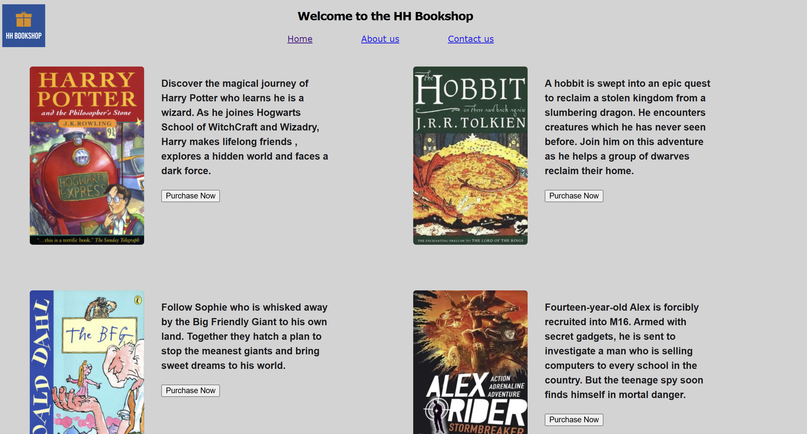
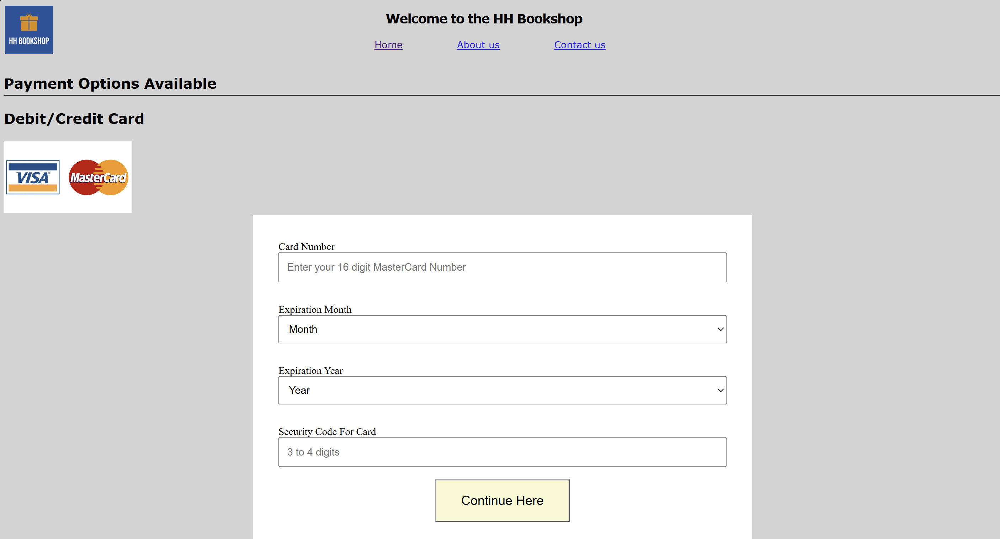
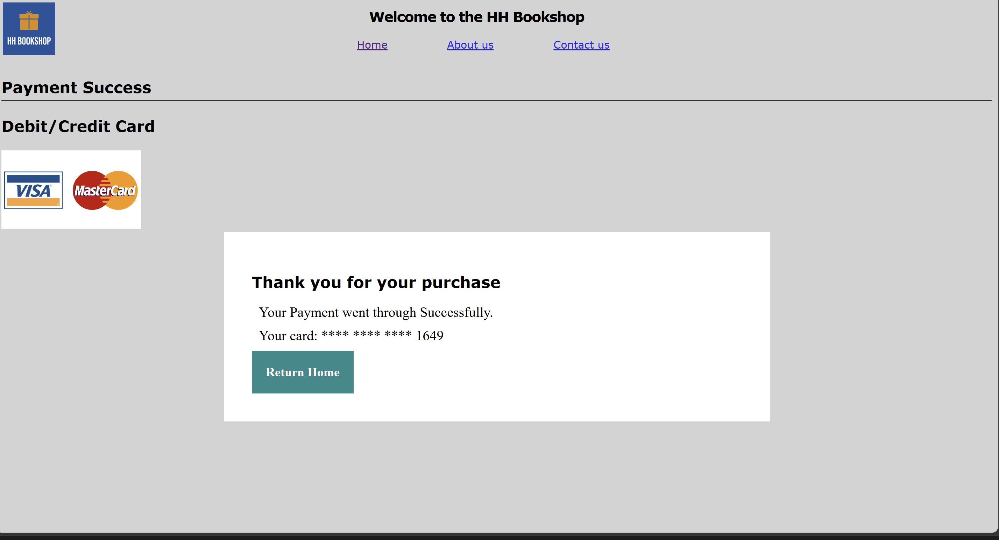

# HH Bookshop - E-Commerce Frontend and Validation Engine

A multi-page frontend web application simulating a secure online bookstore check-out workflow. I built this during Year 1 at Manchester Metropolitan University to demonstrate form validation, making servers talk to each other and data privacy.

## Key Features

### 1. Mastercard Validation Engine
Uses Regular Expressions to verify 16-digit card structures starting with prefixes 51 to 55.

### 2. Live Expiry Verification
Instantiates a JavaScript Date object to cross-examine and block expired card inputs dynamically.
Whatever the current world date is where you are is used.

### 3. Security and Data Masking
Employs string indexing techniques to mask raw inputs, selectively displaying only the last 4 digits on the confirmation screen.

### 4.  API Integration ( allows both servers to talk to each other)
Uses the Fetch API to transmit JSON payloads via POST requests to a remote validation server, handling explicit HTTP status responses.

## Technical Skills I Used
* **Languages:** JavaScript , HTML5, CSS
* **Web APIs:** Fetch API, JSON Stringify, URLSearchParams, DOM Manipulation
* **Developer Tools:** VScode , Mobile Responsive Web Design

## Interface Preview

* None of the sensitive data which is stored is actuallu used or saved by any third parties or external apps
